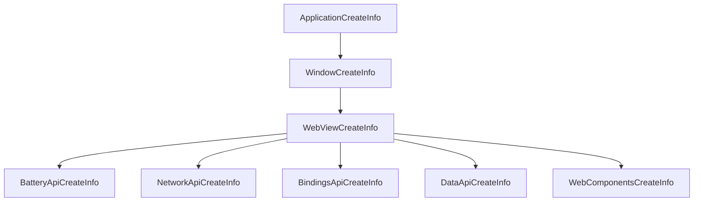

# Configuration

Boson applications are configured using clean, structured DTO (Data Transfer 
Object) classes.

```php
$config = new Boson\ApplicationCreateInfo( 
    name: 'My Application',
    debug: true,
);
```

These DTOs encapsulate all the necessary configuration settings and are passed 
directly into the application's constructor (optionally). 

```php
$app = new Boson\Application( <Boson\ApplicationCreateInfo> );
```

This approach ensures a clear separation of concerns, type safety, 
and easy maintainability — making your setup explicit, predictable, and easy to 
reason about. Whether you're defining window size, webview content, or runtime 
options, everything is handled through well-defined DTOs that keep your codebase 
organized and expressive.

You can read more about each configuration objects in the corresponding
sections of the documentation.

- [Application](../03.application/application-configuration.md)
- [Window](../04.window/window-configuration.md)
- [WebView](../05.webview/webview-configuration.md)

## Hierarchy 

Boson's configuration system is built on a clear and logical hierarchy. At the 
top level, you define global application settings (`ApplicationCreateInfo`) 
— things like the app name, threads count, debug mode, and general behavior.

Nested within those are window-specific configurations (`WindowCreateInfo`), 
where you can control properties such as dimensions, resizability, title, and more. 

Digging even deeper, each window contains its own embedded WebView settings 
(`WebViewCreateInfo`), giving you fine-grained control over how web 
content is rendered, what scripts are allowed, caching policies, and other 
browser-like behaviors.



This layered configuration model keeps your setup organized and modular. Each 
level of the hierarchy focuses on its own responsibilities, making it easier to 
understand, maintain, and scale as your application grows.

> An application without windows and webview in them makes no sense, the 
> configuration settings of the *main window* (as well as the main window 
> itself) are always present and available.
{.note}
