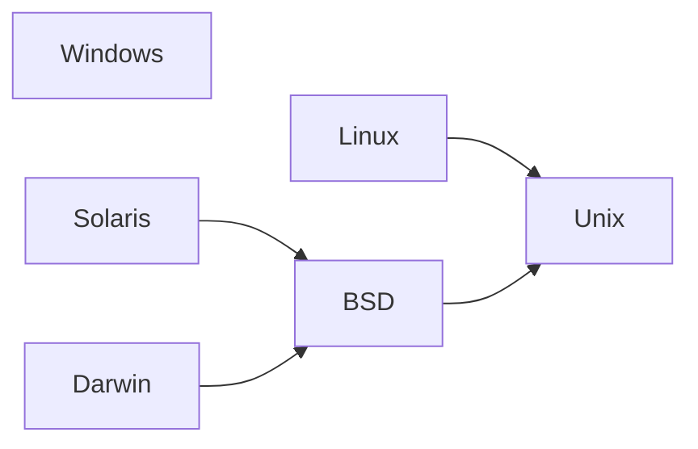

# OS Info

The OS Info component provides a robust and flexible way to detect and work with
operating system information in your applications. It offers a comprehensive 
set of features for identifying operating systems, their families, and 
supported standards.

> This component already included in the `boson-php/runtime`,
> so no separate installation is required when using the runtime.
{.note}


## Installation

Via [Composer](https://getcomposer.org/doc/01-basic-usage.md#installing-dependencies):

```bash
composer require boson-php/os-info
```

**Requirements:**

* `PHP ^8.4`
* `ext-ffi` (optional, provides more detailed and accurate information about the OS)
* `ext-com_dotnet` (optional, provides more detailed and accurate information about the OS)


## Basic Detection

The `OperatingSystem` contains a number of properties that provide
information about the operating system.

- `$os->name` – Name of the operating system.
- `$os->version` – Version of the operating system.
- `$os->codename` – Codename of the operating system. May contain `null` if 
   the information is not available.
- `$os->edition` – Edition of the operating system. May contain `null` if
  the information is not available.
- `$os->family` – Family this operating system belongs to.
  > More detailed information about the family is [described below](../07.components/os-info.md#os-families).
- `$os->standards` – List of standards supported by the operating system.
  > More detailed information about the family is [described below](../07.components/os-info.md#standards-support).


```php
use Boson\Component\OsInfo\OperatingSystem;

// Get current operating system information
$os = OperatingSystem::createFromGlobals();

// Access basic information
echo 'Family: ' . $os->family . "\n";
echo 'Name: ' . $os->name . "\n";
echo 'Version: ' . $os->version . "\n";
echo 'Codename: ' . ($os->codename ?? '~') . "\n";
echo 'Edition: ' . ($os->edition ?? '~') . "\n";
echo 'Standards: ' . implode(', ', $os->standards) . "\n";
```

This code will output something like the following information

**Windows**

```
Family: Windows
Name: Windows 10 Pro
Version: 10.0.19045
Codename: 22H2
Edition: Professional
Standards: ~ 
```

**Linux**

```
Family: Linux
Name: Ubuntu
Version: 20.04.6
Codename: Focal Fossa
Edition: ~
Standards: POSIX
```

**macOS**

```
Family: Darwin
Name: Darwin
Version: 24.4.0
Codename: ~
Edition: ~
Standards: POSIX
```

> Please note that the information in macOS may not be accurate due 
> to virtualization and testing issues.
> Full implementation of macOS support is possible in the future.
{.warning}


## OS Families

You can get the OS family information from the OS information 
object (`$os->family`). However, if you do not need all the OS information, 
it is enough to get the family separately using the `Family::createFromGlobals()`
method.

```php
use Boson\Component\OsInfo\Family;

// Get current OS family
$family = Family::createFromGlobals();

// Strict compliance
if ($family === Family::BSD) {
    // Only BSD OS
}
```

Currently, `Family` may contain the following OS families:

- `Family::Windows` – A Windows and Windows-based OS
- `Family::Linux` – Any Linux OS and its derivatives
- `Family::Unix` – Any non-Linux and non-BSD
- `Family::BSD` – Any BSD OS and its derivatives
- `Family::Solaris` – Any Solaris OS and its derivatives
- `Family::Darwin` – Any macOS and its derivatives

Since the `Family` class implements behavior similar to
[PHP enums](https://www.php.net/manual/ru/language.types.enumerations.php),
you also have access to the `from()`, `tryFrom()` and `cases()` methods.

> Due to many technical limitations of the PHP (for example,
> [unable to use properties](https://externals.io/message/126332),
> [unable to define the `__toString()` method](https://externals.io/message/124991),
> unable to override `from()` & `tryFrom()` methods, etc.),
> this class cannot be implemented using the classic PHP enum.
{.warning}


```php
use Boson\Component\OsInfo\Family;

echo Family::from('windows');
// Windows

echo Family::from('wtf');
// Uncaught ValueError: "wtf" is not a valid backing value for
// enum-like Boson\Component\OsInfo\Family

echo Family::tryFrom('wtf'); 
// null
```

> Please note that the `from()` and `tryFrom()` methods
> are **case-insensitive**.
{.note}

```php
use Boson\Component\OsInfo\Family;

foreach (Family::cases() as $family) {
    echo $family . "\n";
}

//
// Expected Output:
//
//   Windows
//   Unix
//   Linux
//   BSD
//   Solaris
//   Darwin
//
```

### OS Family Name

You can use the `name` property to get the OS family name.

```php
echo Family::createFromGlobals()
    ->name;
    
//
// Expected Output:
//
//   Linux
//
```

The `Family` object also contains a `__toString()` method, so it can be passed
as any `Stringable` value or can be converted to a `string`.

```php
echo Family::createFromGlobals();

//
// Expected Output:
//
//   Linux
//
```


### OS Family Children

Some OS families are derivatives. For example, macOS (Darwin) is a derivative 
of BSD, which in turn is a derivative of Unix.



To get the parent, you should call the `parent` property. However, to check 
for inclusion any OS family in another one, you need to use the `is` method.

```php
// Compatibility check
if ($family->is(Family::BSD)) {
    // BSD and BSD-like, for example:
    //  - BSD
    //  - Solaris
    //  - Darwin (macOS)
    //  - etc
}
```


## Standards Support

You can get the OS standards information from the OS information
object (`$os->standards`).

```php
use Boson\Component\OsInfo\OperatingSystem;

$standards = OperatingSystem::createFromGlobals()
    ->standards;

var_dump($standards);
```

In addition, the `OperatingSystem` instance supports the `isSupports()` 
method to check for support of the specified standard.

```php
use Boson\Component\OsInfo\OperatingSystem;
use Boson\Component\OsInfo\Standard;

$os = OperatingSystem::createFromGlobals();

// Check if OS supports a specific standard
if ($os->isSupports(Standard::Posix)) {
    // Standard is supported
}
```

As you may have noticed, standards are also enum-like class, that implements 
behavior similar to [PHP enums](https://www.php.net/manual/ru/language.types.enumerations.php).
You also have access to the `from()`, `tryFrom()` and `cases()` methods.

> Due to many technical limitations of the PHP (for example,
> [unable to use properties](https://externals.io/message/126332),
> [unable to define the `__toString()` method](https://externals.io/message/124991),
> unable to override `from()` & `tryFrom()` methods, etc.),
> this class cannot be implemented using the classic PHP enum.
{.warning}


```php
use Boson\Component\OsInfo\Standard;

echo Standard::from('posix');
// POSIX

echo Standardv::from('wtf');
// Uncaught ValueError: "wtf" is not a valid backing value for
// enum-like Boson\Component\OsInfo\Standard

echo Standard::tryFrom('wtf'); 
// null
```

> Please note that the `from()` and `tryFrom()` methods
> are **case-insensitive**.
{.note}

```php
use Boson\Component\OsInfo\Standard;

foreach (Standard::cases() as $standard) {
    echo $standard . "\n";
}

//
// Expected Output:
//
//   POSIX
//
```