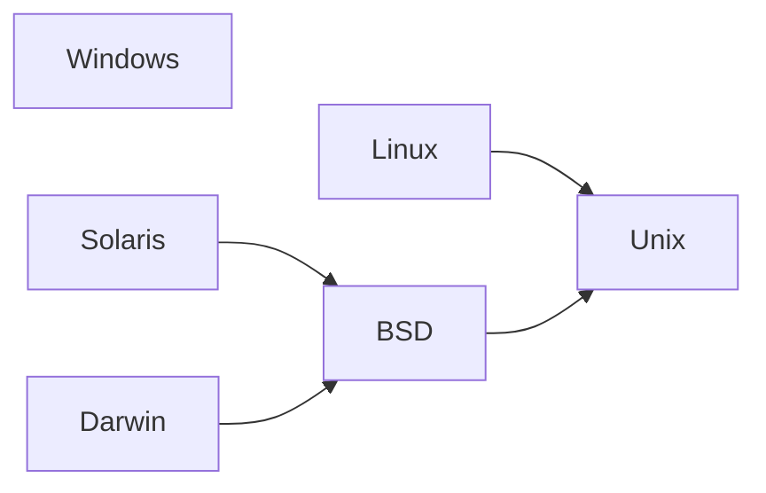

# OS Info

The OS Info component provides a robust and flexible way to detect and work with
operating system information in your applications. It offers a comprehensive 
set of features for identifying operating systems, their families, and 
supported standards.

> This component already included in the `boson-php/runtime`,
> so no separate installation is required when using the runtime.
{.note}


## Installation

Via [Composer](https://getcomposer.org/doc/01-basic-usage.md#installing-dependencies):

```bash
composer require boson-php/os-info
```

**Requirements:**

* `PHP ^8.4`
* `ext-ffi` (optional, provides more detailed and accurate information about the OS)
* `ext-com_dotnet` (optional, provides more detailed and accurate information about the OS)


## Basic Detection


```php
use Boson\Component\OsInfo\OperatingSystem;

// Get current operating system information
$os = OperatingSystem::createFromGlobals();

// Access basic information
echo 'Family: ' . $os->family . "\n";
echo 'Name: ' . $os->name . "\n";
echo 'Version: ' . $os->version . "\n";
echo 'Codename: ' . ($os->codename ?? '~') . "\n";
echo 'Edition: ' . ($os->edition ?? '~') . "\n";
echo 'Standards: ' . implode(', ', $os->standards) . "\n";
```

This code will output something like the following information

**Windows**

```
Family: Windows
Name: Windows 10 Pro
Version: 10.0.19045
Codename: 22H2
Edition: Professional
Standards: ~ 
```

**Linux**

```
Family: Linux
Name: Ubuntu
Version: 20.04.6
Codename: Focal Fossa
Edition: ~
Standards: POSIX
```

**macOS**

```
Family: Darwin
Name: Darwin
Version: 24.4.0
Codename: ~
Edition: ~
Standards: POSIX
```

> Please note that the information in macOS may not be accurate due 
> to virtualization and testing issues.
> Full implementation of macOS support is possible in the future.
{.warning}

## OS Families

You can get the OS family information from the OS information 
object (`$os->family`). However, if you do not need all the OS information, 
it is enough to get the family separately using the `Family::createFromGlobals()`
method.

```php
use Boson\Component\OsInfo\Family;

// Get current OS family
$family = Family::createFromGlobals();

// Strict compliance
if ($family === Family::BSD) {
    // Only BSD OS
}
```

Currently, the component can detect the following OS families:

- `Family::Windows` – A Windows and Windows-based OS
- `Family::Linux` – Any Linux OS and its derivatives
- `Family::Unix` – Any non-Linux and non-BSD
- `Family::BSD` – Any BSD OS and its derivatives
- `Family::Solaris` – Any Solaris OS and its derivatives
- `Family::Darwin` – Any macOS and its derivatives


### OS Family Children

Some OS families are derivatives. For example, macOS (Darwin) is a derivative 
of BSD, which in turn is a derivative of Unix.



To get the parent, you should call the `parent` property. However, to check 
for inclusion any OS family in another one, you need to use the `is` method.

```
// Compatibility check
if ($family->is(Family::BSD)) {
    // BSD and BSD-like, for example:
    //  - BSD
    //  - Solaris
    //  - Darwin (macOS)
    //  - etc
}
```


## Standards Support

```php
use Boson\Component\OsInfo\OperatingSystem;
use Boson\Component\OsInfo\Standard;

$os = OperatingSystem::createFromGlobals();

// Check if OS supports a specific standard
if ($os->isSupports(Standard::Posix)) {
    // Standard is supported
}
```
