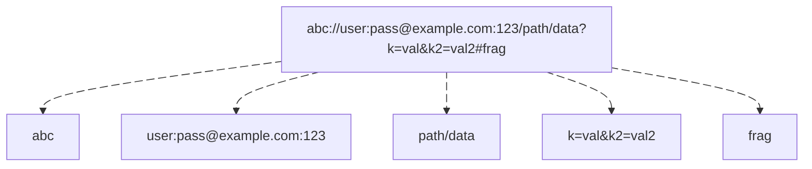

# URI

The component provides a set of URI structures.

> This component already included in the `boson-php/runtime`,
> so no separate installation is required when using the runtime.
{.note}


## Installation

Via [Composer](https://getcomposer.org/doc/01-basic-usage.md#installing-dependencies):

```bash
composer require boson-php/uri
```

**Requirements:**

* `PHP ^8.4`

## URI Class

The URI object is a DTO containing information about the Scheme, Authority, Path, 
Query parameters and Fragment.


