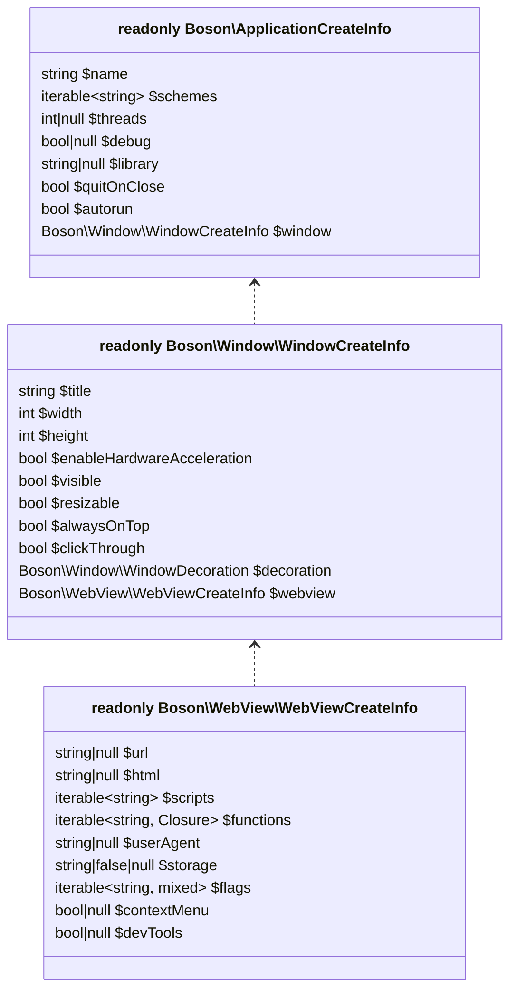

# Configuration

<show-structure for="chapter" depth="2"/>

Boson applications are configured using clean, structured DTO (Data Transfer 
Object) classes.

```php
$config = new Boson\ApplicationCreateInfo( 
    name: 'My Application',
    debug: true,
);
```

These DTOs encapsulate all the necessary configuration settings and are passed 
directly into the application's constructor (optionally). 

```php
$app = new Boson\Application( <Boson\ApplicationCreateInfo> );
```

This approach ensures a clear separation of concerns, type safety, 
and easy maintainability — making your setup explicit, predictable, and easy to 
reason about. Whether you're defining window size, webview content, or runtime 
options, everything is handled through well-defined DTOs that keep your codebase 
organized and expressive.

## Hierarchy 

Boson's configuration system is built on a clear and logical hierarchy. At the 
top level, you define global application settings (`ApplicationCreateInfo`) 
— things like the app name, threads count, debug mode, and general behavior.

Nested within those are window-specific configurations (`WindowCreateInfo`), 
where you can control properties such as dimensions, resizability, title, and more. 

Digging even deeper, each window contains its own embedded WebView settings 
(`WebViewCreateInfo`), giving you fine-grained control over how web 
content is rendered, what scripts are allowed, caching policies, and other 
browser-like behaviors.



This layered configuration model keeps your setup organized and modular. Each 
level of the hierarchy focuses on its own responsibilities, making it easier to 
understand, maintain, and scale as your application grows.

<note>
An application without windows and webview in them makes no sense, the configuration 
settings of the <tooltip term="main window">main window</tooltip> (as well as 
the main window itself) are always present and available.
</note>

## Application

The application configuration class `Boson\ApplicationCreateInfo` is 
<tooltip term="optional class">optional</tooltip> and serves as a convenient 
way to define default settings for initializing your app.

### Application Name

The name of the application. 

```php
$appConfig = new Boson\ApplicationCreateInfo( 
    name: 'Example Application',
);
```

The value is optional and can be used for user needs, as well as for internal ones. 
<tip>
For example as a <a href="https://learn.microsoft.com/en-us/windows/win32/learnwin32/creating-a-window#window-classes">
    WindowClass (WNDCLASS.lpszClassName)
</a> identifier on Windows OS.
</tip>

<warning>The value cannot be changed after the application is created.</warning>

### Intercepted Schemes

Defines custom schemes that your application can handle. 
These schemes allow you to create custom protocols for your application.

```php
$appConfig = new Boson\ApplicationCreateInfo( 
    schemes: [ 'boson' ], // Default is empty array
);
```

<tip>
Each registered scheme in this list will produce a 
`Boson\WebView\Event\WebViewRequest` intention (event) when attempting 
to access a resource located at an address with this protocol.
</tip>

<tabs>
    <tab title="MacOS">
        <warning>
            <b>MacOS</b> does NOT support interception of some existing schemes:
            <list>
            <li><code>http</code></li>
            <li><code>https</code></li>
            <li><code>ws</code></li>
            <li><code>wss</code></li>
            <li><code>ftp</code></li>
            <li><code>file</code></li>
            <li><code>data</code></li>
            </list>
            You will get an error similar to the following:
            <code-block>
            *** Terminating app due to uncaught 
                exception 'NSInvalidArgumentException', reason: "'https' is a URL 
                scheme that WKWebView handles natively"
            *** First throw call stack:
                ...
            </code-block>
        </warning>
    </tab>
</tabs>

<warning>
The value cannot be changed after the application is created.
</warning>

### Threads Count

Specifies the number of physical threads for the application. This affects how 
many concurrent operations your application can handle.

```php
$appConfig = new Boson\ApplicationCreateInfo( 
    threads: 4, // Default is null
);
```

<note>
If the value is not specified (defined as `null`), the number of 
threads will correspond to the number of cores in the CPU.
</note>

<warning>
The value cannot be changed after the application is created.
</warning>

### Debug Mode

Enables or disables debug features, like dev tools and logging. When enabled, 
provides additional diagnostic information and developer tools.

```php
$appConfig = new Boson\ApplicationCreateInfo( 
    debug: true, // Default is null
);
```

<note>
If the value is not specified, the debug mode will be set according to the 
current `php.ini` settings (depends on whether you are using the 
development `php.ini` settings)
</note>

<tip>
The debug mode settings also affects the default settings of child 
configurations, such as <a href="configuration.md#dev-tools">developer tools</a>
(if they are not set explicitly).
</tip>

<warning>
The value cannot be changed after the application is created.
</warning>

### Application Library

Specifies the path to a <a href="https://github.com/BosonPHP/Frontend/releases">
custom frontend library</aa> that should be loaded with the 
application.

```php
$appConfig = new Boson\ApplicationCreateInfo( 
    library: __DIR__ . '/path/to/custom/library.dll', // Default is null
);
```

<note>
In most cases this is not required and the library will be selected 
automatically based on the current operating system and CPU architecture.
</note>

<warning>
The value cannot be changed after the application is created.
</warning>

### Quit On Close

Determines whether the application should terminate when all windows are closed. 
If set to `false`, the application will continue running in the background.

```php
$appConfig = new Boson\ApplicationCreateInfo( 
    quitOnClose: true, // Default is true
);
```

<warning>
The value cannot be changed after the application is created.
</warning>

### Autorun

Responsible for automatic application launch. If autorun is set to 
`false`, you will need to launch the application yourself at the 
moment when it is needed.

```php
$appConfig = new Boson\ApplicationCreateInfo( 
    autorun: false, // Default is true
);
```

<tip>
Autorun is disabled automatically if the application was launched manually 
using `$app->run()`. In other words, autostart will not work again 
(the application will not start twice) if you have already started it yourself.

Therefore, disabling this setting does not make sense.
</tip>

<warning>
The value cannot be changed after the application is created.
</warning>

## Window

The window configuration class `Boson\Window\WindowCreateInfo` is
<tooltip term="optional class">optional</tooltip> and serves as a convenient way to 
define default settings for main window of your app.

### Window Title

Sets the title that appears in the window's title bar and taskbar.

```php
$windowConfig = new Boson\Window\WindowCreateInfo( 
    title: 'My Application Window',
);
```

<note>
The title can be changed later at runtime. More information about window title 
can be found in the <a href="window.md#title">window documentation</a>.
</note>

### Hardware Acceleration

Enables or disables hardware-accelerated rendering for better performance.

```php
$windowConfig = new Boson\Window\WindowCreateInfo( 
    enableHardwareAcceleration: true, // Default is true
);
```

<warning>
MacOS/WebKit: Does not allow to control hardware-acceleration.

This configuration option has no effect.
</warning>

<warning>
The value cannot be changed after the application is created.
</warning>

### Window Size (Width and Height)

Defines the initial dimensions of the window in pixels.

```php
$windowConfig = new Boson\Window\WindowCreateInfo( 
    width: 800,
    height: 600,
);
```

<note>
The size can be changed later at runtime.
</note>

<note>
More information about window size can be found in 
the <a href="window.md#size">window documentation</a>.
</note>

### Window Resizability

Determines if the window can be resized by the user.

```php
$windowConfig = new Boson\Window\WindowCreateInfo( 
    resizable: true, // Default is true
);
```

<warning>The value cannot be changed after the application is created.</warning>

<note>
More information about window size can be found in 
the <a href="window.md#size">window documentation</a>.
</note>

### Window Visibility

Controls whether the window is initially visible when created.

```php
$windowConfig = new Boson\Window\WindowCreateInfo( 
    visible: true, // Default is true
);
```

<note>
Window visibility can be changed later at runtime.
</note>

<note>
More information about window visibility can be found in 
the <a href="window.md#visibility">window documentation</a>.
</note>

### Always On Top

Controls whether a window should stay on top of other windows.

```php
$windowConfig = new Boson\Window\WindowCreateInfo(
    alwaysOnTop: true, // Default is false
);
```

<note>
Window "always on top" feature can be changed later at runtime.
</note>

<note>
More information about window "always on top" feature can be found in 
the <a href="window.md#always-on-top">window documentation</a>.
</note>


### Click Through

Enables or disables the window's handling of mouse events.

```php
$windowConfig = new Boson\Window\WindowCreateInfo(
    clickThrough: true, // Default is false
);
```

<note>
Window "click-through" feature can be changed later at runtime.
</note>

<note>
More information about window "click-through" feature can be found in 
the <a href="window.md#click-through">window documentation</a>.
</note>


### Window Decorations

Specifies the window's border, title bar style and other.

```php
$windowConfig = new Boson\Window\WindowCreateInfo( 
    decoration: Boson\Window\WindowDecoration::Default,
);
```

<note>
Window decorations can be changed later at runtime.
</note>

<note>
More information about window decorations can be found in 
the <a href="window.md#decorations">window documentation</a>.
</note>

## WebView

The webview configuration class `Boson\WebView\WebViewCreateInfo` is
<tooltip term="optional class">optional</tooltip> and serves as a convenient way to 
define default settings for webview of main window instance.

### WebView Content (URL or HTML)

Sets the initial content of the WebView, either through a URL or direct HTML content.

```php
$webviewConfig = new Boson\WebView\WebViewCreateInfo( 
    url: 'https://example.com',
    // or
    html: '<html><body>Hello World</body></html>',
);
```

<warning>
Direct HTML loading implemented via the <code>data:</code> protocol and marks an 
<a href="https://developer.mozilla.org/en-US/docs/Web/Security/Secure_Contexts">insecure context</a>
which does NOT allow the implementation of 
<a href="https://developer.mozilla.org/en-US/docs/Web/Security/Secure_Contexts/features_restricted_to_secure_contexts">some functionality</a>.
</warning>

### Global Scripts

Defines JavaScript code that will be loaded and executed in the 
WebView context <b>after</b> every DOM loaded event.

```php
$webviewConfig = new Boson\WebView\WebViewCreateInfo( 
    scripts: [
        "document.body.setAttribute('data-some', '{$some}')"
    ],
);
```

### Global Functions

Registers PHP functions that can be called from JavaScript.

```php
$webviewConfig = new Boson\WebView\WebViewCreateInfo( 
    functions: [
        'foo' => static fn(int $arg): int => $arg * 2;
    ],
);

// Now the "foo(Number): Promise<Number>" can be called 
// from JS as "let result = await foo(42);" 
```

### Default User Agent

Sets a custom user agent string for the WebView.

```php
$webviewConfig = new Boson\WebView\WebViewCreateInfo( 
    userAgent: 'MyCustomUserAgent/1.0',
);
```

<warning>
The value cannot be changed after the application is created.
</warning>

### Storage (Persistent Client Settings)

Configures persistent storage settings for the WebView.

If storage is enabled, persistent settings will be saved between 
different app executions, such as saved passwords, history, and other data 
shared across browsers.

```php
$webviewConfig = new Boson\WebView\WebViewCreateInfo( 
    storage: '/path/to/storage', // Defaults to false (disabled)
);
```

The storage value can take on different types:
- `false` - The storage will be **disabled**.
- `null` - The storage will be **enabled** and directory will be 
  determined automatically based on the current working directory.
- `string` - The storage will be **enabled** and directory will be
  based on the passed argument.

<warning>
The value cannot be changed after the application is created.
</warning>

### Extra Flags

Sets additional WebView configuration flags.

```php
$webviewConfig = new Boson\WebView\WebViewCreateInfo( 
    flags: [
        'enable-javascript' => false,
    ],
);
```

These are additional <b>platform-dependent</b> launch flags and their behavior may 
differ on different platforms.

<tabs>
<tab title="Windows">
    For WebView2 list of all available flags can be 
    <a href="https://learn.microsoft.com/en-us/dotnet/api/microsoft.web.webview2.core.corewebview2environmentoptions.additionalbrowserarguments">found on MSDN</a>
    and <a href="https://www.chromium.org/developers/how-tos/run-chromium-with-flags/">chromium.org</a>
    <code-block lang="PHP">
    $webviewConfig = new Boson\WebView\WebViewCreateInfo(flags: [
        '--disable-features' => ['feature1', 'feature2'],
        '--do-something',
    ]);
    </code-block>
</tab>
<tab title="Linux (GTK)">
    For WebkitGTK list of all available flags can be 
    <a href="https://webkitgtk.org/reference/webkitgtk/stable/class.Settings.html#properties">found at webkitgtk.org</a>
    <code-block lang="PHP">
    $webviewConfig = new Boson\WebView\WebViewCreateInfo(flags: [
        'enable-javascript' => false,
    ]);
    </code-block>
</tab>
<tab title="MacOS">
    For WKWebView list of all available flags can be 
    <a href="https://developer.apple.com/documentation/webkit/wkwebviewconfiguration">found at developer.apple.com</a>
    <code-block lang="PHP">
    $webviewConfig = new Boson\WebView\WebViewCreateInfo(flags: [
         'upgradeKnownHostsToHTTPS' => true,
         'defaultWebpagePreferences.allowsContentJavaScript' => false,
         'preferences.minimumFontSize' => 10,
         'applicationNameForUserAgent' => 'Boson',
    ]);
    </code-block>
</tab>
</tabs>

<warning>The value cannot be changed after the application is created.</warning>

### Context Menu

Controls whether the default context menu (right mouse button) is enabled.

```php
$webviewConfig = new Boson\WebView\WebViewCreateInfo( 
    contextMenu: true, // Default is false
);
```

<warning>The value cannot be changed after the application is created.</warning>

### Dev Tools

Enables or disables developer tools for the WebView.

```php
$webviewConfig = new Boson\WebView\WebViewCreateInfo( 
    devTools: true, // Default is null
);
```

The developer tools settings can take one of the following values:
- `true` - Enables developer tools window.
- `false` - Disables developer tools window.
- `null` - Depends on the application `debug` settings. 
  Developer tools will be enabled if debug is enabled and vice versa.

<warning>The value cannot be changed after the application is created.</warning>
