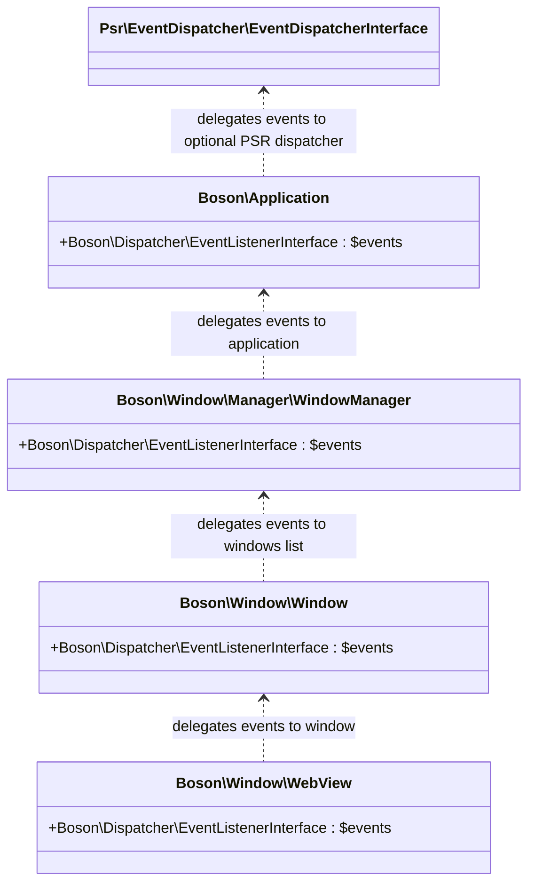

# Events

<show-structure for="chapter" depth="2"/>

Boson provides several different events. Event subscriptions are hierarchical 
and are arranged in the following order.



You can subscribe to a specific event at any level, receiving all the 
corresponding events of the context.

```php
// Subscribe to events of application and all its windows
$app->events->addEventListener(Event::class, fn($e) => ...);

// Subscribe to events of one specific window
$window->events->addEventListener(Event::class, fn($e) => ...);
```

## Events and Intentions

Any event is a fact. Events **can not** be changed or rejected. 

Unlike events, an intent is an attempt by the application or any of its 
components to do something. Any intent **can** be rejected or modified.

Both events and intentions use a common event bus within 
the Boson application.

### Stop Propagation

<secondary-label ref="event"/>
<secondary-label ref="intention"/>

To stop the "event bubbling" there is a method `Event::stopPropagation()`.

When this method is called, the event will not be delegated to the upper level 
of event listener and all subsequent subscribers of this level of event listener
that were registered after.

```php
// ❌ event will NOT fired
$parent->events->addEventListener(Event::class, fn($e) => ...);

// ✅ event will be fired (registered BEFORE the propagation stop)
$child->events->addEventListener(Event::class, fn($e) => ...);

// ✅ event will be fired (callback stops "event bubbling")
$child->events->addEventListener(Event::class, function($e): void {
    $e->stopPropagation();
});

// ❌ event will NOT fired (registered AFTER the propagation stop)
$child->events->addEventListener(Event::class, fn($e) => ...);
```

The read-only property `Event::$isPropagationStopped` (or alternative 
PSR-compatible method `Event::isPropagationStopped()`) is available to check 
for propagation stop events.

```php
if ($event->isPropagationStopped) {
    echo 'Event propagation is stopped';
}
```

### Timestamp

<secondary-label ref="event"/>
<secondary-label ref="intention"/>

Each event also contains the timestamp `Event::$time` read-only property 
of the event creation. The property contain an int32 value of UNIX timestamp.

```php
echo date('d-m-Y', $event->time); // string("06-05-2025")
```

### Cancellation

<secondary-label ref="intention"/>

Method `Intention::cancel()` is used to stop and prevent the standard behavior.

For example, if you call the `cancel()` method when trying to stop an 
application, the application will not be stopped. Therefore, the application 
stop event will not be called either.

```php
$events->addEventListener(ApplicationStopping::class, function($e): void {
    $e->cancel();
});
```
